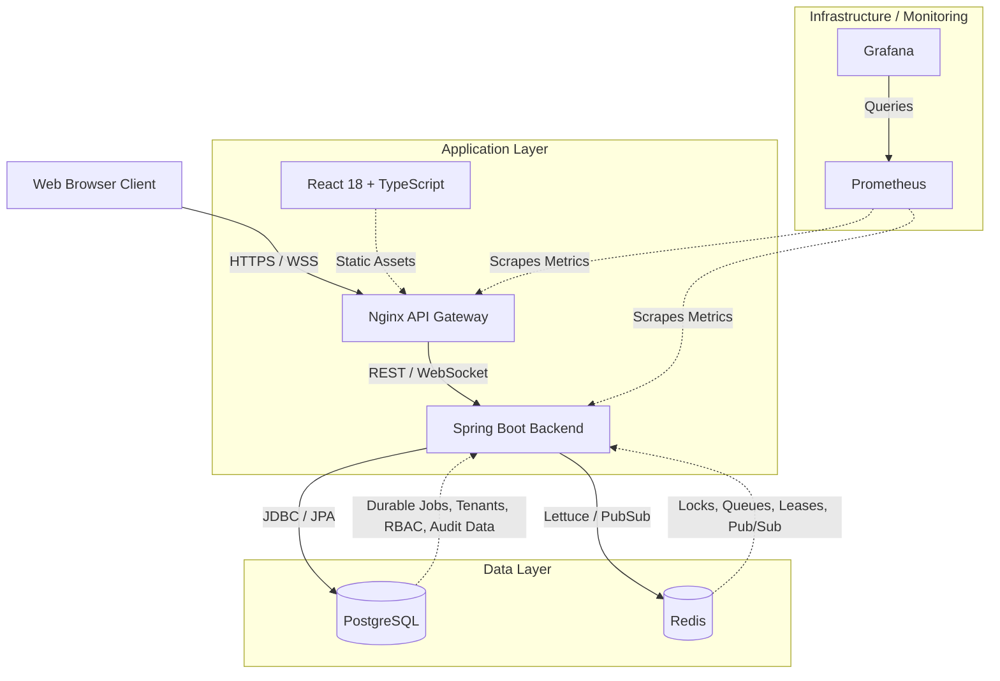
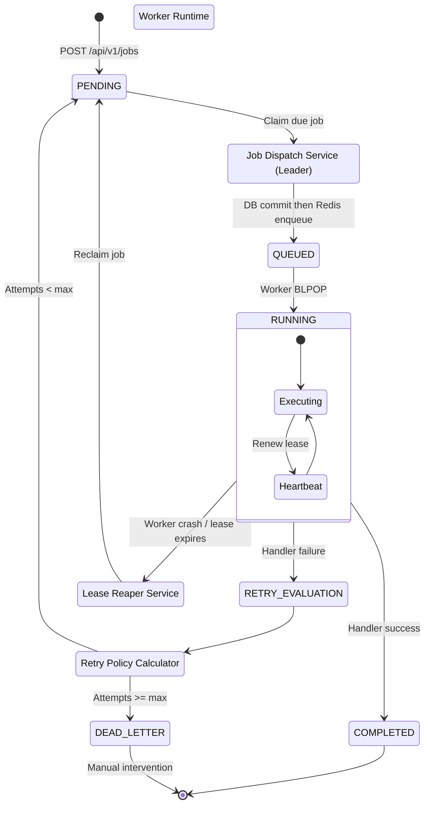
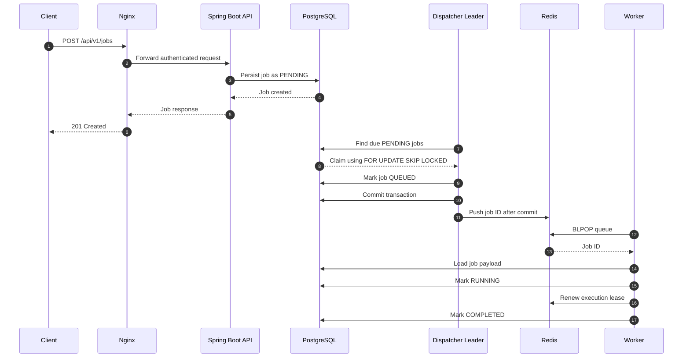
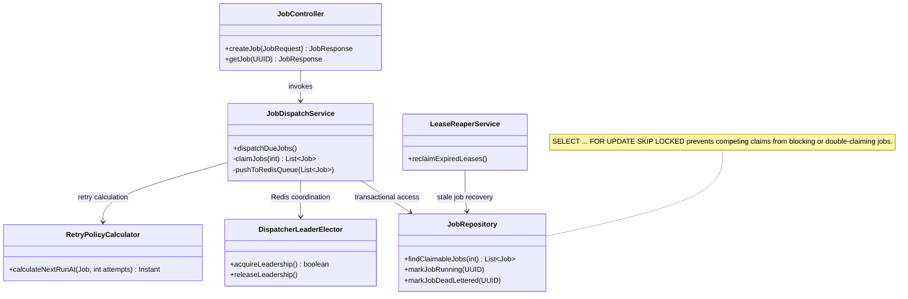
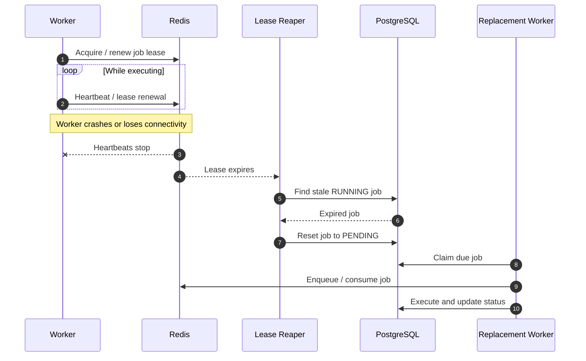
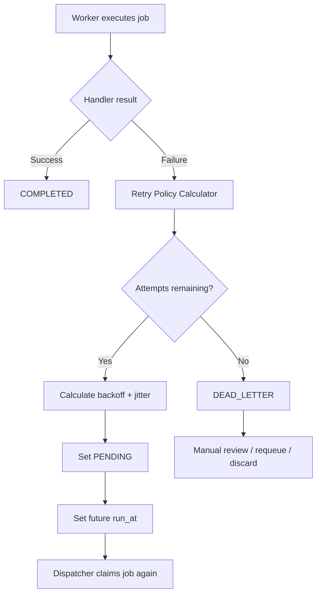
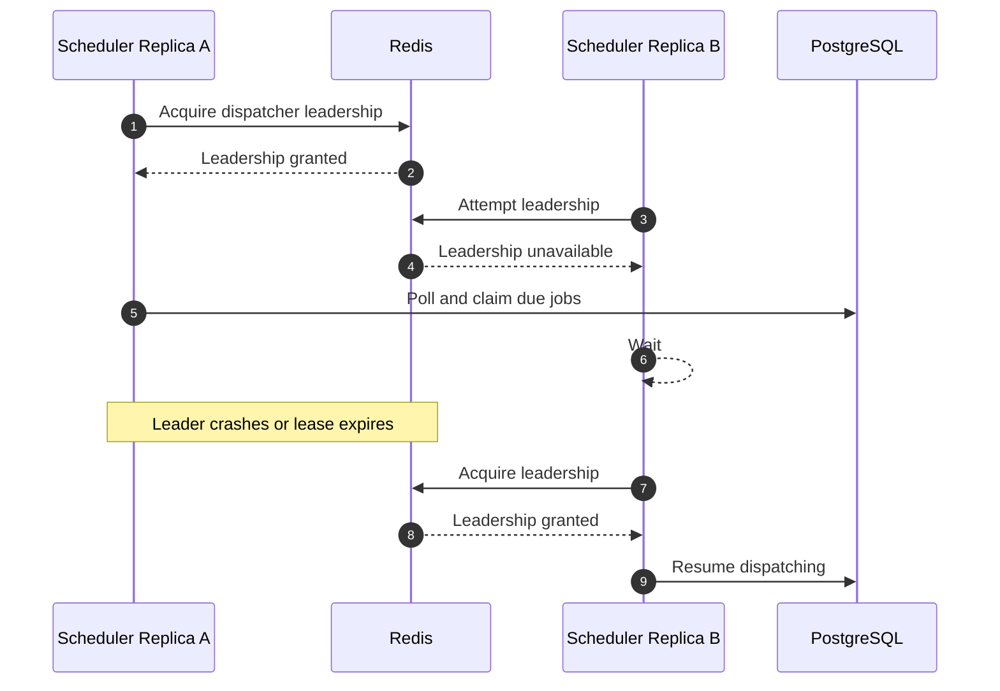
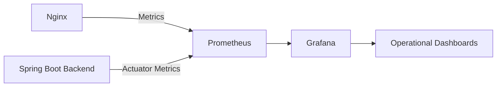

# Distributed Job Scheduler

A production-grade distributed job scheduling platform built with Spring Boot 3, Java 21, PostgreSQL, Redis, React 18, TypeScript, Nginx, Prometheus, and Grafana.

The platform provides durable job scheduling, atomic distributed claiming, Redis-backed dispatch, worker lease recovery, retry policies with jitter, dead-letter handling, multi-tenant RBAC, API keys, notifications, AI insights, REST APIs, WebSockets, and operational monitoring.

## Table of Contents

- [Overview](#overview)
- [Architecture](#architecture)
  - [System Architecture](#system-architecture)
  - [Job Lifecycle](#job-lifecycle)
  - [Low-Level Backend Design](#low-level-backend-design)
  - [End-to-End Request Flow](#end-to-end-request-flow)
  - [Worker Crash Recovery](#worker-crash-recovery)
  - [Retry and Dead-Letter Flow](#retry-and-dead-letter-flow)
  - [Leader Election](#leader-election)
  - [Observability Flow](#observability-flow)
- [Core Design Decisions](#core-design-decisions)
- [Features](#features)
- [Technology Stack](#technology-stack)
- [Project Structure](#project-structure)
- [Running Locally](#running-locally)
- [API Example](#api-example)
- [Testing](#testing)
- [Architecture Documentation](#architecture-documentation)

## Overview

The scheduler separates API traffic, durable persistence, job dispatch, queue delivery, and worker execution.

The primary execution path is:

`Client -> Nginx -> Spring Boot -> PostgreSQL -> Redis -> Worker -> PostgreSQL`

PostgreSQL is the durable source of truth. Redis is used for fast queue delivery, distributed coordination, leases, heartbeats, and Pub/Sub.

## Architecture

### System Architecture

The high-level architecture shows how the browser, gateway, frontend, backend, database, Redis, and observability stack interact.



### Architecture Components

| Component | Responsibility |
|---|---|
| React Frontend | Job creation, job monitoring, queue management, worker monitoring, analytics, AI insights and administration |
| Nginx | Reverse proxy, frontend serving, REST routing and WebSocket routing |
| Spring Boot Backend | Authentication, authorization, scheduling, dispatching, retries, worker coordination and APIs |
| PostgreSQL | Durable storage for jobs, executions, tenants, queues, workers, audit logs and RBAC |
| Redis | Queue delivery, leader election, distributed locks, leases, heartbeats and Pub/Sub |
| Worker Runtime | Consumes jobs, loads job data, executes handlers, renews leases and reports results |
| Prometheus | Metrics collection |
| Grafana | Operational dashboards and monitoring |

### Job Lifecycle

This is the complete lifecycle of a job from creation to completion, retry, dead-lettering, or crash recovery.



### End-to-End Request Flow

A normal job request moves through the system in the following order.



### Low-Level Backend Design

The low-level design shows the main Spring Boot services involved in scheduling, claiming, retries, leadership, and crash recovery.



### Worker Crash Recovery

Workers maintain an execution lease while processing a job. If the worker stops renewing the lease, the reaper can make the job eligible again.



### Retry and Dead-Letter Flow

Failures are handled by the retry policy calculator. Exponential jitter is used to reduce synchronized retry storms.



Supported retry policies include:

- FIXED
- LINEAR
- EXPONENTIAL
- EXPONENTIAL_JITTER

### Leader Election

Only the elected dispatcher leader aggressively polls PostgreSQL for due jobs. Leadership is coordinated through Redis.



### Observability Flow

Metrics are collected from the gateway and Spring Boot backend and exposed through Prometheus for Grafana dashboards.



## Core Design Decisions

### PostgreSQL as the Durable Claiming Layer

Due jobs are claimed with:

```sql
SELECT id
FROM job_executions
WHERE status = 'PENDING'
  AND run_at <= NOW()
FOR UPDATE SKIP LOCKED
LIMIT :batchSize;
```

This allows concurrent database transactions to skip rows already locked by another transaction instead of waiting for those rows.

### Redis for Fast Dispatch

After the PostgreSQL transaction commits, the dispatcher pushes the job ID into a Redis queue.

The important ordering is:

```text
PostgreSQL claim
      |
      v
Update job state
      |
      v
Commit transaction
      |
      v
afterCommit()
      |
      v
Redis queue
```

This avoids publishing a job to Redis before its durable database state has committed.

### Redis-Backed Leadership

The dispatcher uses Redis-backed leadership so multiple application replicas can exist without all replicas aggressively polling and dispatching the same workload.

### Lease-Based Worker Recovery

A worker must continuously renew its lease. If it stops renewing because of a crash or network failure, the lease expires and the scheduler can reclaim the job.

### Retry with Jitter

Exponential jitter introduces randomized delay between retries so many failed jobs do not retry simultaneously against the same downstream dependency.

## Features

### Backend

- Spring Boot 3
- Java 21
- REST APIs
- JWT authentication
- API key authentication
- Multi-tenant RBAC
- PostgreSQL persistence
- Redis queues
- Redis-backed leader election
- Atomic `SKIP LOCKED` job claiming
- Cron scheduling
- Worker runtime
- Redis `BLPOP` consumption
- Worker lease renewal
- Graceful shutdown
- Crash recovery
- Retry engine
- Exponential jitter
- Dead-letter queue
- Email, Slack and Webhook notifications
- AI insights
- WebSocket live updates
- Audit logs
- Analytics
- Testcontainers integration tests

### Frontend

- React 18
- TypeScript
- Vite
- Tailwind CSS
- JWT silent refresh
- React Query
- STOMP/SockJS live job feed
- Recharts
- Dark/light theme
- Job management
- Queue management
- Worker fleet monitoring
- Dead-letter queue management
- AI insights explorer
- Audit log viewer
- API key management
- Organization management

### Database and Infrastructure

- 11 Flyway migrations
- Multi-tenant schema
- Partitioned `job_executions`
- Partitioned `audit_logs`
- Indexing strategy
- Docker Compose
- PostgreSQL
- Redis
- Nginx
- Prometheus
- Grafana

## Technology Stack

| Layer | Technologies |
|---|---|
| Frontend | React 18, TypeScript, Vite, Tailwind CSS, React Query, STOMP/SockJS, Recharts |
| Backend | Java 21, Spring Boot 3, Spring Security |
| Persistence | PostgreSQL, JPA/Hibernate, Flyway |
| Queue / Coordination | Redis, Lettuce |
| Authentication | JWT, API Keys, RBAC |
| Real-Time | WebSocket, STOMP, SockJS, Redis Pub/Sub |
| Testing | JUnit, Testcontainers |
| Gateway | Nginx |
| Observability | Prometheus, Grafana |
| Deployment | Docker Compose |

## Project Structure

```text
distributed_job_scheduler/
├── backend/
│   ├── src/main/java/
│   │   └── com/scheduler/platform/
│   │       ├── api/
│   │       ├── domain/
│   │       ├── scheduler/
│   │       ├── worker/
│   │       ├── infrastructure/
│   │       └── security/
│   ├── src/main/resources/
│   │   └── db/migration/
│   └── pom.xml
├── frontend/
│   ├── src/
│   ├── package.json
│   └── vite.config.*
├── docs/
│   └── architecture/
│       ├── HLD.md
│       ├── DFD.md
│       └── LLD.md
├── docker-compose.yml
├── .env.example
└── README.md
```

## Running Locally

### Prerequisites

- Docker
- Docker Compose
- Git

### Start the platform

```bash
cp .env.example .env
```

Set at least `DB_PASSWORD` and a secure `JWT_SECRET` in `.env`.

Then:

```bash
docker compose up -d --build
docker compose logs -f backend
```

Wait for:

```text
Started JobSchedulerPlatformApplication
```

### Services

| Service | URL |
|---|---|
| Dashboard | http://localhost |
| Swagger UI | http://localhost/swagger-ui.html |
| Backend API | http://localhost:8080/api/v1 |
| Prometheus | http://localhost:9090 |
| Grafana | http://localhost:3001 |

For local development, the seeded demo account is:

```text
Email: admin@demo.local
Password: ChangeMe123!
```

Rotate the password immediately outside local development.

## API Example

### Login

```bash
curl -X POST localhost:8080/api/v1/auth/login \
  -H 'Content-Type: application/json' \
  -d '{
    "email":"admin@demo.local",
    "password":"ChangeMe123!"
  }'
```

### Create a Job

Use the `accessToken` returned from login.

```bash
curl -X POST localhost:8080/api/v1/jobs \
  -H "Authorization: Bearer <accessToken>" \
  -H 'Content-Type: application/json' \
  -d '{
    "name":"demo-job",
    "queueId":"00000000-0000-0000-0000-000000000010",
    "handlerType":"noop",
    "jobType":"ONE_OFF",
    "runAt":"2026-01-01T00:00:00Z"
  }'
```

## Testing

Unit tests:

```bash
cd backend
mvn test
```

Integration tests with Testcontainers:

```bash
mvn verify
```

Docker must be running for the Testcontainers integration suite.

The most important concurrency test is `JobClaimingConcurrencyTest`, which validates that concurrent schedulers do not double-claim the same jobs.

## Architecture Documentation

Detailed architecture documents are available in the repository:

- [High-Level Design](docs/architecture/HLD.md)
- [Data Flow Diagram](docs/architecture/DFD.md)
- [Low-Level Design](docs/architecture/LLD.md)

The README intentionally embeds the main architecture diagrams so the complete system can be understood directly from the repository landing page.

## Implementation Notes

The most important implementation areas to inspect are:

- `JobRepository.findClaimableJobs` for atomic `SKIP LOCKED` claiming.
- `Job` for centralized job state transitions.
- `RetryPolicyCalculator` for retry and jitter calculations.
- `JobDispatchService` for transactional claiming and post-commit Redis dispatch.
- `DispatcherLeaderElector` for distributed scheduler leadership.
- `LeaseReaperService` for worker crash recovery.
- Redis queue consumers for worker-side job delivery.
- Flyway migrations for the multi-tenant database model.

## Current Scope

Implemented and runnable:

- Backend job scheduling and dispatch
- Distributed claiming
- Worker execution
- Lease-based recovery
- Retry and DLQ handling
- Security and RBAC
- Notifications
- AI insights
- WebSocket updates
- React dashboard
- Docker Compose infrastructure
- Unit and Testcontainers integration tests

Not currently included:

- GitHub Actions CI workflows
- A production external secrets manager
- A production-grade Kubernetes deployment configuration

The dashboard throughput chart currently uses illustrative data because a dedicated `/analytics/throughput` time-series endpoint is not yet implemented.
