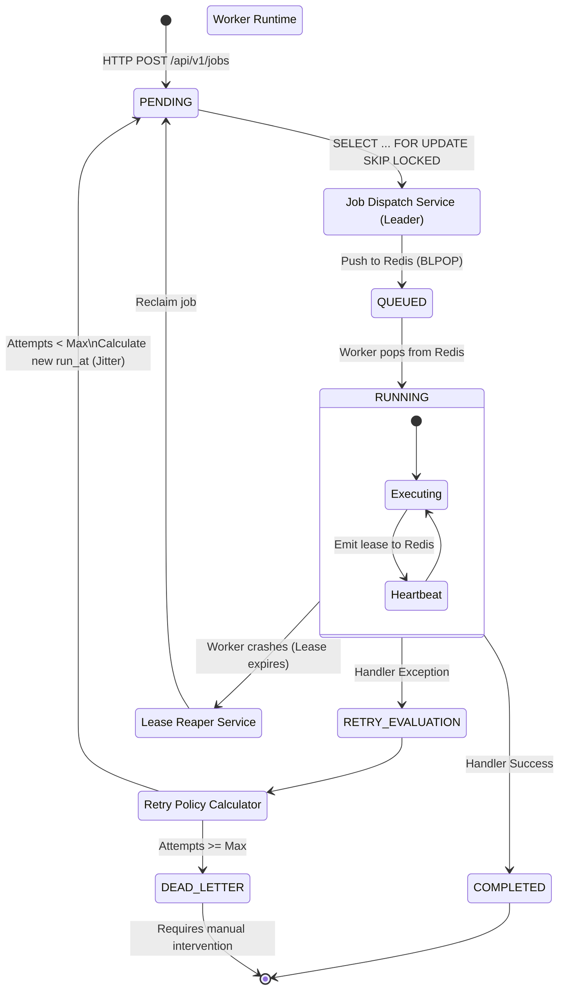

# Data Flow Diagram (DFD)

## Job Lifecycle

The following diagram maps the lifecycle and data flow of a single job, from HTTP creation to successful execution, retries, and potential dead-lettering.

### Flow Walkthrough

1.  **Creation**: A client submits a POST request to create a job. The job is immediately saved to PostgreSQL with a status of `PENDING` and a specific `run_at` timestamp.
2.  **Dispatch (Claiming)**: The `DispatcherLeaderElector` ensures only one scheduler node is active. This leader runs the `JobDispatchService`, which polls Postgres using `SKIP LOCKED` to fetch due `PENDING` jobs.
3.  **Queueing**: Claimed jobs have their status updated to `QUEUED` in the database, and their IDs are pushed into a Redis List acting as a fast memory queue.
4.  **Execution**: A distributed worker (running a `BLPOP` command against Redis) instantly receives the job ID. The worker fetches the payload from Postgres, marks the status as `RUNNING`, and begins execution.
5.  **Heartbeats**: While executing, the worker continuously pings Redis to renew its "lease". If the worker's JVM crashes or the network partitions, the heartbeat stops, and the lease expires.
6.  **Resolution**:
    -   **Success**: The job is marked `COMPLETED` in PostgreSQL.
    -   **Failure**: The `RetryPolicyCalculator` determines if the job should be retried. If yes, it calculates the next exponential backoff (with jitter) and resets the status to `PENDING` with the future `run_at`. If retries are exhausted, it goes to `DEAD_LETTER`.
    -   **Crash**: The `LeaseReaperService` spots the expired Redis lease for a `RUNNING` job and resets it to `PENDING` so another worker can pick it up.
