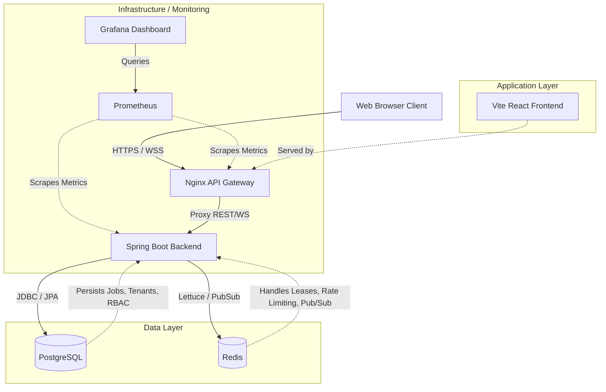

# High-Level Design (HLD)

## System Architecture

The Job Scheduler Platform is a modern, distributed job execution engine. The following diagram illustrates the high-level architecture, highlighting the primary communication paths between the client, gateway, application services, and backing data stores.

### Components

1.  **Web Browser Client**: The end-user interface for monitoring jobs, executing analytics, and managing the worker fleet.
2.  **Nginx API Gateway**: Acts as a reverse proxy, routing traffic to either the static frontend assets or the backend REST/WebSocket APIs. It also serves as the entry point for Prometheus metrics scraping.
3.  **Vite React Frontend**: A single-page application (SPA) built with React 18, TypeScript, and Tailwind CSS. It communicates with the backend via REST for standard operations and WebSockets for real-time job updates.
4.  **Spring Boot Backend**: The core engine built on Java 21 and Spring Boot 3. It handles job orchestration, multi-tenant security (JWT/API Keys), and worker lease management.
5.  **PostgreSQL**: The primary relational database. Crucially, it doubles as the durable job queue mechanism using `SELECT ... FOR UPDATE SKIP LOCKED` for atomic job claiming, preventing double-execution across distributed workers.
6.  **Redis**: Utilized for high-speed ephemeral data, specifically for distributed locking, worker lease heartbeats, and Pub/Sub notifications for real-time WebSocket fanout.
7.  **Prometheus & Grafana**: The observability stack. Prometheus scrapes metrics exposed by the Spring Boot Actuator and Nginx, while Grafana provides visual dashboards (e.g., job throughput, worker health).
