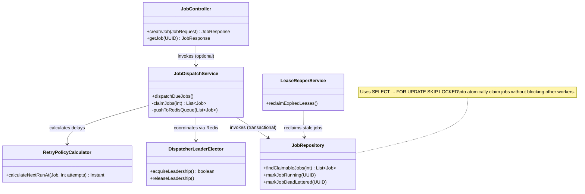

# Low-Level Design (LLD)

## Spring Boot Backend Architecture

The backend is built around a robust, concurrent task execution model. The core challenge is preventing double-dispatch of jobs in a multi-replica deployment while ensuring crashed workers release their claims.

### Component Details

#### 1. `JobRepository` (Postgres SKIP LOCKED)
The foundation of the scheduling system. Instead of complex distributed locking or a separate message broker for claims, it relies on PostgreSQL's `SKIP LOCKED` feature.
- **Query:** `SELECT id FROM job_executions WHERE status = 'PENDING' AND run_at <= NOW() FOR UPDATE SKIP LOCKED LIMIT :batchSize`
- **Why?** It allows multiple instances of `JobDispatchService` to query the database concurrently. If Instance A locks row 1 and 2, Instance B will instantly skip those rows and grab rows 3 and 4, without waiting for Instance A's transaction to commit.

#### 2. `JobDispatchService` (Transactional Dispatch)
Responsible for fetching due jobs and moving them to the active processing state.
- It executes within a `@Transactional` block.
- It claims jobs via the repository, updates their status to `RUNNING` or `QUEUED`, and then uses a `TransactionSynchronizationManager.registerSynchronization(new TransactionSynchronization() { ... afterCommit() })` hook to push the job IDs to the Redis processing queue. This guarantees that jobs are only enqueued in Redis *after* the database transaction safely commits.

#### 3. `DispatcherLeaderElector`
To prevent the thundering herd problem where all replicas try to poll the database for jobs at the exact same millisecond, a Redis-backed leader election mechanism is used.
- Only the elected leader replica aggressively polls for jobs.
- If the leader crashes, the Redis lock expires, and another replica takes over seamlessly.

#### 4. `RetryPolicyCalculator`
A pure Java function that calculates the next `runAt` timestamp for a failed job based on its configured retry policy.
- Supports `LINEAR`, `FIXED`, and `EXPONENTIAL_JITTER`.
- **Jitter** is crucial for preventing retry storms, adding randomized variance to exponential backoffs so that a batch of failing jobs doesn't all retry at the exact same millisecond later.

#### 5. `LeaseReaperService`
If a worker crashes mid-execution, its job would theoretically stay in the `RUNNING` state forever.
- Workers emit heartbeats to Redis to maintain a "lease" on a job.
- The `LeaseReaperService` periodically scans for jobs in `RUNNING` state whose leases have expired in Redis, moving them back to `PENDING` (or DLQ if retries are exhausted).
